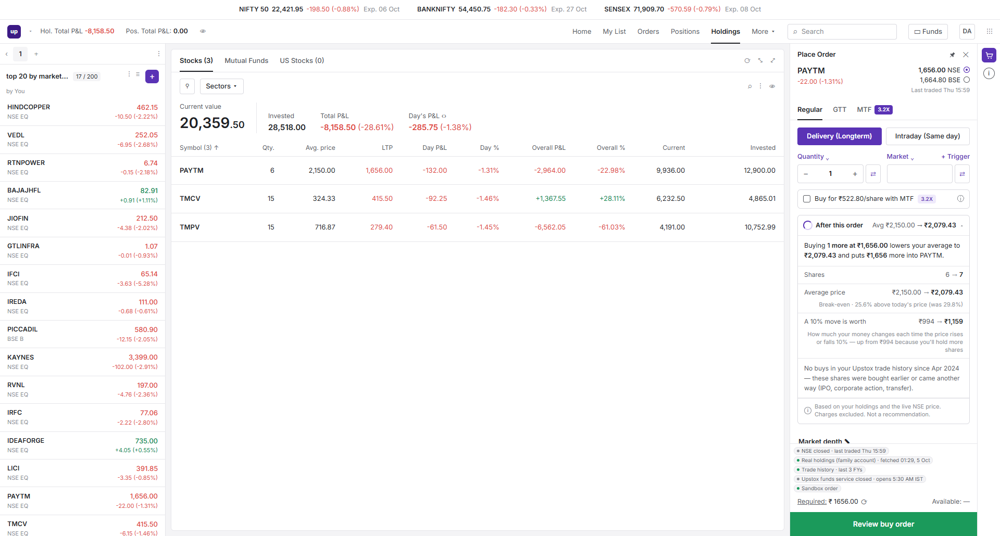

# Add-More Check

A card inside the Upstox Pro **BUY** ticket that shows, before you place the order, what it does to a position you
already hold: shares, average price, break-even, how much a 10% move is worth, and your buy history. There is a GTT
variant, an MTF variant, a re-entry line for stocks you sold earlier, and a US-stocks version that shows the dollar
average and the rupee average side by side.

**PM take-home:** start with [SUBMISSION.md](SUBMISSION.md), the write-up with the video link.

**Every number on screen comes from a live API.**
- India: the **Upstox Developer API**. Holdings, trade history, LTP v3, the Market Data Feed V3 WebSocket, historical
  candles, the margin and funds APIs, market status, and the sandbox order API.
- US: the **Alpaca paper API**, with USD/INR from **Upstox's live global-indicator feed**.

If a source is down, the app shows a labelled cached copy or says "unavailable". It never shows a guessed value.



## Run it

```powershell
npm install
node scripts/check-env.mjs           # every key/token verified with a live call
npm run dev                          # http://127.0.0.1:3000  (bound to localhost only)
```

The OAuth token expires every day at 3:30 AM IST. Refresh it with `node scripts/upstox-login.mjs` (it needs the
account holder's OTP), then run `node scripts/fetch-upstox-cache.mjs`. Until you do, holdings and trade history come
from the cache, labelled `cached <time>`. Market data keeps working, because the Analytics token lasts a year.

| Command | What it does |
|---|---|
| `npm test` | 115 unit tests: SPEC formulas and copy, edge cases, live-or-cache, 429 backoff, order isolation and same-origin posts, paper-only Alpaca, Invested, GTT trigger ⇄ %, per-exchange ticks, Market-order price sampling, US lots at today's live rate |
| `npm run test:slow` | About 60 s: the real price-feed client against a local WebSocket server. A silent (half-open) socket is dropped and the feed reconnects; a quiet but healthy one is kept |
| `npm run build` | Production build. `NEXT_DIST_DIR=.next-verify npm run build` builds alongside a running dev server. |
| `node scripts/verify-card.mjs 3` | Recomputes the card from the **raw** Upstox JSON (independent of `src/`), so you can check the screen by hand |
| `node scripts/smoke-api.mjs` | Calls every `/api/*` route on the running app and prints the real values |
| `node scripts/sse-soak.mjs 65` | Holds the live price stream open for 65 s and reports events |
| `node scripts/scan-secrets.mjs` | Proves no token from `.env.local` appears in the build output |
| `node scripts/serve-reference.mjs` | Serves the approved design (`reference/`) on :3100 for side-by-side comparison |
| `node scripts/check-overflow.mjs [--shots]` | Classic (Windows) scrollbars: checks the order panel never scrolls sideways; `--shots` saves evidence screenshots |

## How it works (the Upstox Pro flow)

The holdings page opens without an order panel, as on pro.upstox.com. Hover a holding and click **Buy** or **Sell** (or
**B / S** on a watchlist row); pick **NSE** or **BSE** in "Exchange to Buy From" (live prices for both); the **Place Order**
panel slides in. On a held stock the BUY ticket carries the **Add-More Check** card under the MTF row. ✕ closes the
panel; the cart icon in the right rail reopens it. The human's own Upstox screenshots that define this flow are in
`reference/screenshots/upstox-pro-*.png`.

## What is real

| On screen | Source |
|---|---|
| Holdings, average price, T1 shares | `GET /v2/portfolio/long-term-holdings` (OAuth). Upstox's own average is used as the truth. |
| Buy history ("Buys so far …") | `GET /v2/charges/historical-trades`, last 3 FYs. This account has **0 trades** since Apr 2024, so the card says so. |
| Prices, ticker, watchlist | LTP v3 + Market Data Feed V3 (WebSocket → `/api/stream` SSE). Last-trade time shown when the market is closed. |
| MTF "Buy for ₹522.80/share", 3.2X, "you pay" | `POST /v2/charges/margin` with `product: "MTF"`. These are the same figures Upstox Pro shows. |
| Index expiries, BSE listing, tick sizes | Upstox public instrument master |
| US position, fills, price | Alpaca **paper**: `/v2/positions`, `/v2/account/activities FILL`, IEX latest trade, `/v2/clock` |
| USD/INR now / on each buy date | Upstox `GLOBAL_INDICATOR\|USDINR`: feed tick now, daily candle close per date |
| Exchange picker (NSE / BSE price and change) | LTP v3 / feed for each exchange's key (`NSE_EQ\|ISIN`, `BSE_EQ\|ISIN`) |
| "Required: ₹ …" in the ticket | `POST /v2/charges/margin` for the exact order (side, product, quantity, price) |
| "Available: ₹ …", insufficient-funds line, **Add funds** | `GET /v2/user/get-funds-and-margin` (OAuth) — this account has ₹0.00, so a buy shows Add funds, as Upstox does. Upstox's Funds service is closed 00:00–05:30 IST (UDAPI100072): the ticket then says so in a chip and shows "Available: —" |
| Which ticket opens | The stock you press: an Indian stock (holdings / watchlist → NSE/BSE) opens the Upstox ticket; Buy / Sell on a row of the holdings **US Stocks** tab opens the US ticket (no India/US switch in the panel) |
| Today's buys/sells in the card ("incl. 3 bought today") | `GET /v2/order/trades/get-trades-for-day` (delivery trades), merged with Holdings |
| Order ID on the receipt | `POST https://api-sandbox.upstox.com/v3/order/place` (sandbox token, `ENABLE_SANDBOX_ORDER=true`) — BUY or SELL on the picked exchange |

The full row → endpoint → field → token map is in [artifacts/API_MAP.md](artifacts/API_MAP.md). The watchlist *names*
come from `data/watchlist.json`, because Upstox has no watchlist API; they were copied from the account's own Upstox
Pro screen. Their prices are live.

## How it is built

Next.js 14 (App Router) + TypeScript, with plain CSS ported verbatim from the approved design
(`reference/add-more-check-demo.html`) and vitest. All tokens are read only in `src/server/*`; the browser only ever
talks to this app's `/api/*` routes.

```
src/lib/compute.ts      SPEC formulas (pure, unit-tested): averages, gaps, 10% moves, buy history, re-entry, US + FX
src/lib/copy.ts         every string on the card and receipt (fact-only; CPO-approved wording)
src/server/*            Upstox/Alpaca clients, live-or-cache, instrument keys, WebSocket feed, order (sandbox only)
src/app/api/*           holdings · trades · ltp · stream · instruments · fx · margin · funds · us/* · order
src/components/*        Upstox Pro replica + AddMoreCard + ConfirmSheet + source chips
```

Every phase passed a review gate by four agents (visual QA, CPO, Senior PM, CTO); their verdicts are in
[PROGRESS.md](PROGRESS.md). Deploying to Vercel is covered in [DEPLOY.md](DEPLOY.md). What only a human can do is listed
in [HUMAN_TODO.md](HUMAN_TODO.md). The demo script is in [docs/DEMO_RUNBOOK.md](docs/DEMO_RUNBOOK.md).
